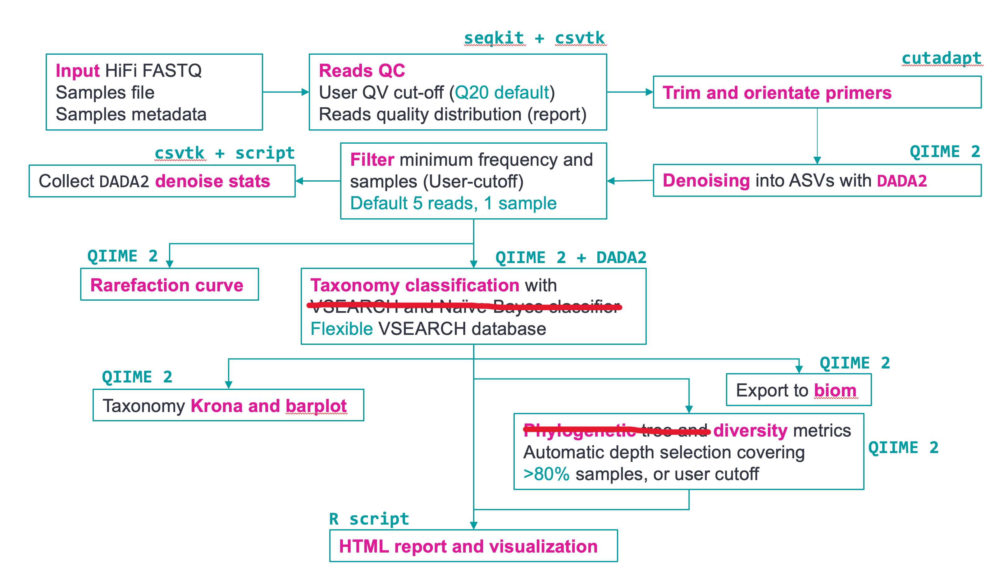

# HiFi Full-length ITS analysis, using the pb-16S-nf pipeline as a backbone

- Table of Contents
  * [Workflow overview and output](#workflow-overview-and-output)
  * [Installation and usage](#installation-and-usage)
  * [HPC and job scheduler usage](#hpc)
  * [Speeding up the denoising process](#pooling)
  * [Run time and compute requirements](#runtime)
  * [Frequently asked questions (FAQ)](#faq)
  * [References](#references)
  * [DISCLAIMER](#disclaimer)

## The pipeline is currently under active development.

## Workflow overview and output



This Nextflow pipeline is designed to process PacBio HiFi full-length ITS data into high- quality amplicon sequence variants (ASVs) using `QIIME 2` and `DADA2`. 
The pipeline provides a set of visualizations using the `QIIME 2` framework for interactive plotting. The pipeline generates an HTML report for
the important statistics and top taxonomies. The outputs and stages of this pipeline are documented [here](pipeline_overview.md).


## Installation and usage
This pipeline runs using Nextflow Version 22 and later. If you have Singularity or Docker on your
cluster, we recommend using Singularity or Docker to run the pipeline by specifying `-profile singularity` or
`-profile docker` when running the pipeline. Singularity will pull the docker images to the folder `$HOME/nf_conda/singularity`.

By default, all software dependencies are managed using `Conda`. Nextflow will use `Conda` to build
the required environment so there is no need to manually build environments.
You can install Nextflow by following the steps here ([documentation](https://www.nextflow.io/docs/latest/getstarted.html)) 
or by using `Conda` itself:

```
conda install -c bioconda nextflow

# If this is your first time using conda
conda init
```

After installing Nextflow, clone the repository using the following commands. To update the pipeline in the future, 
type `git pull`.

```
git clone https://github.com/roylejw/pb-ITS-nf.git
cd pb-ITS-nf
```

After downloading the databases (AGRF uses the UNITE database), run the following command in the cloned folder to see the options for the pipeline:

```
nextflow run main.nf --help

  Usage:
  This pipeline takes in the standard sample manifest and metadata file used in
  QIIME 2 and produces QC summary, taxonomy classification results and visualization.

  For samples TSV, two columns named "sample-id" and "absolute-filepath" are
  required. For metadata TSV file, at least two columns named "sample_name" and
  "condition" to separate samples into different groups.

  nextflow run main.nf --input samples.tsv --metadata metadata.tsv \\
    --dada2_cpu 8 --vsearch_cpu 8

  By default, sequences are first trimmed with cutadapt. If adapters are already trimmed, you can skip 
  cutadapt by specifying "--skip_primer_trim".

  Other important options:
  --downsample    Limit reads to a maximum of N reads if there are more than N reads (default: off)
  --max_ee    DADA2 max_EE parameter. Reads with number of expected errors higher than
              this value will be discarded (default: 2)
  --pooling_method    QIIME 2 pooling method for DADA2 denoise see QIIME 2 - Testing suggests to always use independent pooling. 
  --maxreject    max-reject parameter for VSEARCH taxonomy classification method in QIIME 2
                 (default: 100)
  --maxaccept    max-accept parameter for VSEARCH taxonomy classification method in QIIME 2
                 (default: 100)
  --vsearch_identity    Minimum identity to be considered as hit (default 0.95)
  --rarefaction_depth    Rarefaction curve "max-depth" parameter. By default the pipeline
                         automatically select a cut-off above the minimum of the denoised 
                         reads for >80% of the samples. This cut-off is stored in a file called
                         "rarefaction_depth_suggested.txt" file in the results folder
                         (default: null)
  --dada2_cpu    Number of threads for DADA2 denoising (default: 94)
  --vsearch_cpu    Number of threads for VSEARCH taxonomy classification (default: 94)
  --cutadapt_cpu    Number of threads for primer removal using cutadapt (default: 16)
  --outdir    Output directory name (default: "results")
  --vsearch_db	Location of VSEARCH database 
  --vsearch_tax    Location of VSEARCH database taxonomy 
  --skip_primer_trim    Trims primers provided (default: true)
  --skip_nb    Skip Naive-Bayes classification (only uses VSEARCH) (default: true)
  --colorby    Columns in metadata TSV file to use for coloring the MDS plot
               in HTML report (default: condition)
  --publish_dir_mode    Outputs mode based on Nextflow "publishDir" directive. Specify "copy"
                        if requires hard copies. (default: copy)
  --version    Output version
```

To run this pipeline on your data, create the sample TSV and metadata TSV following
the test data format (for metadata, if you do not have any grouping, put any words in the "condition" column) 
and run the workflow similar to the above. 
Remember to specify the `--outdir` directory to avoid overwriting existing results.

## HPC and job scheduler usage <a name="hpc"></a>

The pipeline uses "Local" by default to run jobs on HPC. This can be changed
in the `nextflow.config` file under `executor` to use HPC schedulers such as
Slurm, SGE and so on using Nextflow's native support. For example, to use Slurm, 
open the `nextflow.config` file and change `executor = 'Local'` to `executor = 'slurm'` and 
specify the partition to be used using `queue = PARTITION`. See the Nextflow 
[documentation](https://www.nextflow.io/docs/latest/executor.html) for the available
executors and parameters. CPUs for `VSEARCH`, `DADA2` and `cutadapt` can be specified as command-line
parameters. For all the other processes, they use any of the default
labels in `nextflow.config` and can be changed according to your needs.

Note that the `nextflow.config` file, by default, will 
generate the workflow DAG and resources reports to help in benchmarking the resources
required. See the `report_results` folder created after the pipeline finishes running 
for the DAG and resources report.


## Frequently asked questions (FAQ) <a name="faq"></a>
* Can I restart the pipeline?

  Yes! The Nextflow pipeline can be resumed after interruption by adding the `-resume` option 
  in the `nextflow run` command when you run the pipeline. Nextflow is intelligent enough to not rerun
  any steps if it does not need to. For example, if you want to manually provide the 
  rarefaction/sampling depth after the pipeline finishes, rerun by adding 
  `-resume --rarefaction_depth 5000` and only the steps that uses sampling/rarefaction depth will be rerun.
  Of course, any downstream steps will also be rerun.

* Why `cutadapt`?

  The naive Bayes classified in QIIME 2 requires the ASVs to be in the same sequence orientation.
  PacBio's CCS reads have random orientations out of the instrument, hence they need to
  to be oriented first; this can be done using either `lima` or `cutadapt`. 
  Technically, `lima` has this capability too but it requires BAM input. There are many
  public datasets on SRA in FASTQ format and `lima` will not orient them. Due to the 
  accuracy of HiFi reads, the performance difference between `lima` and `cutadapt` should be
  minimal in our experience.

  Without the read orientation, you will notice that the taxonomy assignments can produce
  strange results, such as archea assignment only at the highest taxonomy level.

* I'm getting `Conda` "Safety" error indicating a corrupted package or that some
pipeline steps are not able to find specific command-line tools (e.g. qiime).

  Sometimes the conda cache can become corrupted if you run many workflows
  in parallel before the environment was created, thus causing conflicts between
  different workflow competing to create the same environment. We recommend running
  the test dataset above and then wait for it to finish first so the conda
  environment is created successfully. Subsequent runs will use the same
  environment, and will not need to recreate the environment. If the errors still
  occur, try running `conda clean -a` and remove the offending `conda` package cache
  in the cache directory. For example, if the error happens for QIIME, delete any folder in `conda info` 
  "package cache" containing QIIME.

  You can try to install the QIIME 2 environment directly to inspect any error messages:

  `conda env create -n q2_test -f qiime2-2022.2-py38-linux-conda.yml`

* I want to understand more about OTU versus ASV.

  Zymo Research provides a good article on the difference between ASV and OTU here: (https://www.zymoresearch.com/blogs/blog/microbiome-informatics-otu-vs-asv).
  In addition, [this thread](https://forum.qiime2.org/t/esv-vs-otu-deflation-qiime1-vs-2/14867/2) on the
  `QIIME 2` forum discusses the difference in numbers through traditional OTU compared to the ASV approach.

* Can I classify with X database?
  
  With the current implementation, it is straightforward to import any database to use with VSEARCH. You will need the
  `X.fasta` sequences and the corresponding taxonomy for each sequence in the FASTA file. The taxonomy format should be
  in a 2-columns TSV file. Example:
  ```
  seq1  d__Bacteria;p__Proteobacteria;c__Gammaproteobacteria;o__Enterobacterales;f__Enterobacteriaceae;g__Enterobacter;s__Enterobacter asburiae_B
  seq2  d__Bacteria;p__Proteobacteria;c__Gammaproteobacteria;o__Enterobacterales;f__Enterobacteriaceae;g__Enterobacter;s__Enterobacter asburiae_B
  ```
  Then, import both the sequences and taxonomy into the `QZA` format for `QIIME 2`:
  ```
  qiime tools import --type 'FeatureData[Sequence]' --input-path 'X.fasta' --output-path X.qza
  qiime tools import --type 'FeatureData[Taxonomy]' --input-format HeaderlessTSVTaxonomyFormat --input-path X.taxonomy.tsv --output-path X.taxonomy.qza
  ```
  Then supply `X.qza` to `--vsearch_db`, `X.taxonomy.qza` to `--vsearch_tax`. It is not straightforward to use it with
  the Naive-Bayes approach, yet, so please also set `--skip_nb` to use only VSEARCH for classification.

* The pipeline failed in report generation with error code 137 (e.g. issue #21).

  If you have many samples with diverse sample types such as environmental samples, it is possible that DADA2 will generate 
  a very large number of ASVs. The script to produce the report may subsequently fail due to running out of memory
  trying to process all the ASVs. You may want to consider splitting the different sample types into individual
  Nextflow runs to avoid this issue. Alternatively, if you have a cluster with a lot of memory, you can assign higher 
  memory to the step that fails using `nextflow.config`.

* Can I get the output in hard copy instead of symlinks? (Issue #22)
  
  By default, `Nextflow` provides output in absolute symlinks (linked to files in the `work` folder) to avoid duplicating
  files. This is controlled by the `publishDir` directive (see here: https://www.nextflow.io/docs/latest/process.html#publishdir)
  in each process. The pipeline implements a global `--publish_dir_mode` that allows user to specify a global `publishDir`
  mode. For example, `nextflow run main.nf --publish_dir_mode copy` will provide all outputs in hard copy. Note that the files
  will still exist as duplicates in the `work` folder. You may delete the `work` folder when the pipeline finishes successfully.

## References
### QIIME 2
* Bolyen, E. et al. Reproducible, interactive, scalable and extensible microbiome data science using QIIME 2. Nat Biotechnol 37, 852–857 (2019).
* For individual citations of plugins, you can use the `--citations` command for the relevant plugins. For example, if you want
  to cite `VSEARCH` plugin, type `qiime feature-classifier classify-consensus-vsearch --citations` after activating the conda
  environment. You can activate the environment installed by the pipelines by typing `conda activate $HOME/nf_conda/$ENV` (Change 
  `$ENBV` to the name of the environment you want to activate).
### DADA2
* Callahan, B. J. et al. DADA2: High-resolution sample inference from Illumina amplicon data. Nat Methods 13, 581–583 (2016).
### Seqkit
* Shen, W., Le, S., Li, Y. & Hu, F. SeqKit: A Cross-Platform and Ultrafast Toolkit for FASTA/Q File Manipulation. PLOS ONE 11, e0163962 (2016).
### Cutadapt
* Martin, M. Cutadapt removes adapter sequences from high-throughput sequencing reads. EMBnet.journal 17, 10–12 (2011).
### GTDB database
* Parks, D. H. et al. A standardized bacterial taxonomy based on genome phylogeny substantially revises the tree of life. Nat Biotechnol 36, 996–1004 (2018).
* Parks, D. H. et al. A complete domain-to-species taxonomy for Bacteria and Archaea. Nat Biotechnol 38, 1079–1086 (2020).
### SILVA database
* Yilmaz, P. et al. The SILVA and “All-species Living Tree Project (LTP)” taxonomic frameworks. Nucleic Acids Research 42, D643–D648 (2014).
* Quast, C. et al. The SILVA ribosomal RNA gene database project: improved data processing and web-based tools. Nucleic Acids Research 41, D590–D596 (2013).
### RDP database
* Cole, J. R. et al. Ribosomal Database Project: data and tools for high throughput rRNA analysis. Nucleic Acids Res 42, D633–D642 (2014).
### RefSeq database
* O’Leary, N. A. et al. Reference sequence (RefSeq) database at NCBI: current status, taxonomic expansion, and functional annotation. Nucleic Acids Res 44, D733-745 (2016).
### Krona plot
* Bd, O., Nh, B. & Am, P. Interactive metagenomic visualization in a Web browser. BMC bioinformatics 12, (2011).
* We use the QIIME 2 plugin implementation here: https://github.com/kaanb93/q2-krona
### Phyloseq and Tidyverse (for HTML report visualization)
* McMurdie, P. J. & Holmes, S. phyloseq: An R Package for Reproducible Interactive Analysis and Graphics of Microbiome Census Data. PLOS ONE 8, e61217 (2013).
* Wickham, H. et al. Welcome to the Tidyverse. Journal of Open Source Software 4, 1686 (2019).
### PICRUSt2
* Douglas, G. M. et al. PICRUSt2 for prediction of metagenome functions. Nat Biotechnol 38, 685–688 (2020).

## DISCLAIMER
THIS WEBSITE AND CONTENT AND ALL SITE-RELATED SERVICES, INCLUDING ANY DATA, 
ARE PROVIDED "AS IS," WITH ALL FAULTS, WITH NO REPRESENTATIONS OR WARRANTIES 
OF ANY KIND, EITHER EXPRESS OR IMPLIED, INCLUDING, BUT NOT LIMITED TO, ANY 
WARRANTIES OF MERCHANTABILITY, SATISFACTORY QUALITY, NON-INFRINGEMENT OR FITNESS 
FOR A PARTICULAR PURPOSE. YOU ASSUME TOTAL RESPONSIBILITY AND RISK FOR YOUR USE 
OF THIS SITE, ALL SITE-RELATED SERVICES, AND ANY THIRD PARTY WEBSITES OR 
APPLICATIONS. NO ORAL OR WRITTEN INFORMATION OR ADVICE SHALL CREATE A WARRANTY 
OF ANY KIND. ANY REFERENCES TO SPECIFIC PRODUCTS OR SERVICES ON THE WEBSITES 
DO NOT CONSTITUTE OR IMPLY A RECOMMENDATION OR ENDORSEMENT BY PACIFIC BIOSCIENCES.
